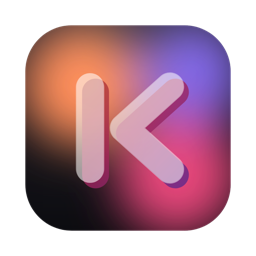

<p align="center">
  
</p>

# Koloft — Releases

Public download mirror for **Koloft**, a macOS desktop app that runs and manages
**Claude Code** (the `claude` command-line tool). The source lives in a private repo;
this repo only hosts the macOS arm64 installer so anyone can download it.

What Koloft does:

- Pick a **workspace** (a folder). Koloft lists every Claude session that folder already
  has, straight from Claude's own storage, and lets you start new ones or resume old ones.
- Each session gets a **Workbench** panel beside it: the files Claude changed, a file
  browser and editor, a real in-app browser the agent can drive, and a shell.
- Each workspace gets a plain-text **note**.
- **Multi-account balancing**: register several Claude accounts and every launch starts
  on the least-loaded one.
- A built-in **statusline** (model, cost, context, git branch), OS **notifications** when
  a session needs you, and an in-app **updater**.

Koloft was called **KCC** through v0.18, and this repo was `kcc-releases`; the old URLs
still redirect here. Upgrading from a KCC build keeps your settings, accounts and browser
logins — the app carries them across on first launch, and the installer removes the old
`KCC.app`.

## Install (macOS, Apple Silicon)

```bash
curl -fsSL https://raw.githubusercontent.com/superkoh/koloft-releases/main/install.sh | bash
```

This fetches the latest `.dmg` and installs `Koloft.app` into `/Applications`. The build
is an **unsigned** personal build, but because `curl` never sets the macOS quarantine
flag, the app opens with a normal double-click — no Gatekeeper "damaged" prompt, no paid
Apple Developer ID.

Prefer the dmg by hand? Grab it from [Releases](../../releases), drag it to Applications,
then clear the quarantine flag once (a *browser* download sets it, and on macOS Sequoia the
old right-click → Open bypass is gone):

```bash
xattr -dr com.apple.quarantine /Applications/Koloft.app
```

## Updating

Koloft updates itself: **Koloft ▸ Check for Updates…** in the menu bar downloads the
latest release, shows what changed, and swaps the app in place.

The install command works too — it always grabs the latest release and replaces any
existing `/Applications/Koloft.app`, so there's no need to uninstall first:

```bash
curl -fsSL https://raw.githubusercontent.com/superkoh/koloft-releases/main/install.sh | bash
```

**Coming from KCC (0.18 or earlier)?** KCC's own "Update" button will fail — it looks for
`KCC.app` inside the installer, and the app is now called `Koloft.app`. Quit KCC and run
the install command once; every later update works from inside the app.

If Koloft is open while you update by command, quit it (Cmd-Q) and reopen to start the new
version. To check what you currently have installed:

```bash
defaults read /Applications/Koloft.app/Contents/Info.plist CFBundleShortVersionString
```

## Uninstall

```bash
rm -rf /Applications/Koloft.app
```
